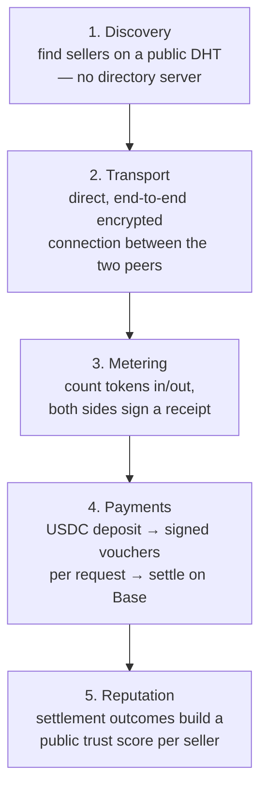
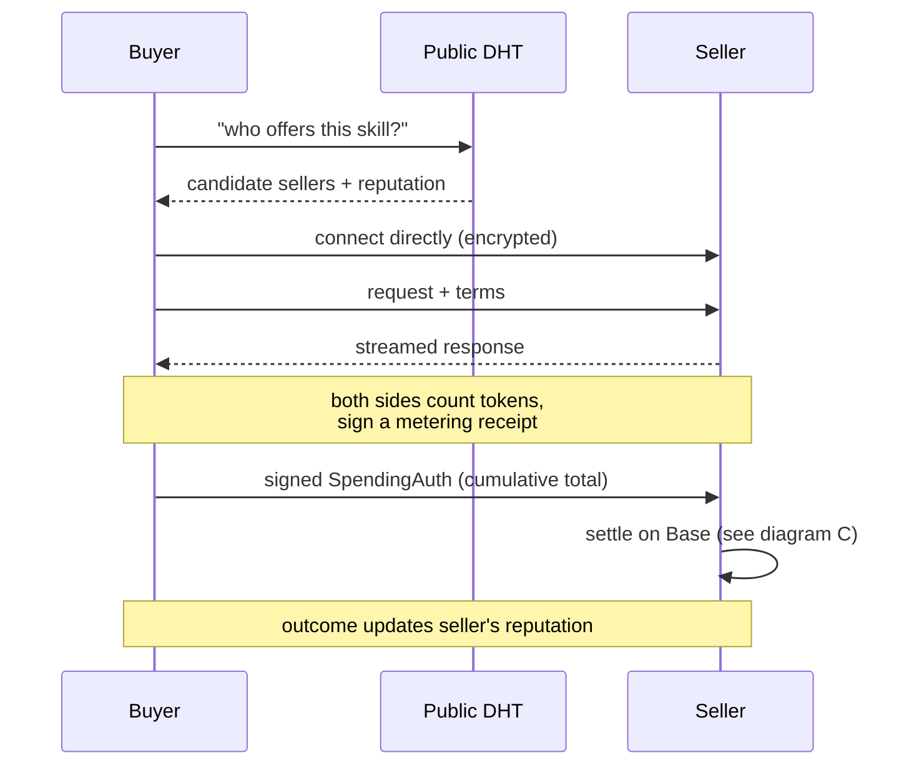
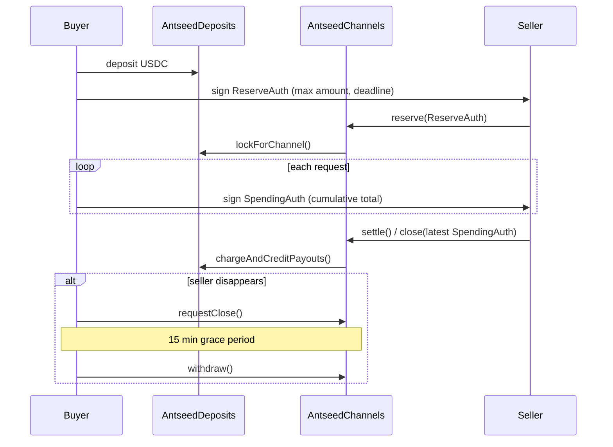

# Protocol Section Plan — new "Protocol" tab + ANTS/Tokenomics merge

Status: **proposal, not yet implemented.** This document is the plan only —
no application code changes are in this PR. Once reviewed, implementation
follows as one or more separate PRs (see "Rollout" below).

## Ask

Add a section that explains the AntSeed protocol itself — the actual
peer-to-peer mechanics, not the token — with an architecture-flow diagram
that an ordinary visitor (not just a protocol engineer) can follow. At the
same time, `TokenomicsTab.jsx` and `ANTSInfo.jsx` currently overlap (both
show ANTS supply/allocation); merge them into one section with two sub-tabs
and stop duplicating that content.

## Non-goals

- No fabricated numbers — every static claim in the new content is sourced
  from `apps/website/docs/protocol/*.md` and the main monorepo's
  `CLAUDE.md` (Payment Flow section), per `AGENTS.md`'s rule.
- No image assets (no PNG/SVG exported from draw.io/Visio/Figma). Diagrams
  are text-defined and rendered live, so they stay editable by editing a
  string, not by reopening a design tool and re-exporting a file.
- `About.jsx`'s existing "Two Layers, One Protocol" and "How Payments Work"
  sections are not touched. They stay as the short prose version; the new
  Protocol tab is additive depth (full 5-layer stack + diagrams), not a
  rewrite of what's already there. See "Relationship to About" below.
- No backend/API changes.

## Why diagrams-as-text, not draw.io/Visio

A draw.io or Visio export is a binary/XML file that lives outside the
codebase — updating the diagram means reopening the tool, editing shapes,
re-exporting a PNG, and committing a new binary that can't be diffed. The
plan instead uses **Mermaid**: the diagram *is* its text source, committed
as a plain JS string, diffable like any other code, and rendered client-side
to an inline SVG (never a static image file). Two side benefits:

1. The same Mermaid source can be pasted into `docs/ARCHITECTURE.md` or the
   main monorepo's `docs/protocol/`, and GitHub renders it natively in the
   markdown preview — no library needed there. This plan's own diagrams
   below render directly in this PR for that reason.
2. It keeps `notes/dev-plan.md`'s open bundle-size concern from getting
   worse: `mermaid` (~500KB) is only ever dynamically `import()`-ed inside
   the new Protocol tab component, so it ships as its own chunk and adds
   zero weight to every other tab.

## 1. New "Protocol" tab

### Framing

AntSeed's own metaphor does the explaining: a real ant colony has no boss
ant directing every worker, yet the colony functions. AntSeed's network has
no central server — independent peers (buyers and sellers) find each other
and trade directly. The tab opens with that one sentence before anything
technical, then breaks the protocol into its five layers (source:
`apps/website/docs/protocol/overview.md`), each given a plain-language line
first and a technical line second:

| Layer | Plain-language line | Technical line |
|---|---|---|
| 1. Discovery | "Find who's selling what, with no directory office to ask." | BitTorrent DHT + service metadata |
| 2. Transport | "Talk to that seller directly, privately." | Direct, end-to-end encrypted TCP/WebRTC |
| 3. Metering | "Both sides keep the same receipt of what was used." | Token counting, signed usage receipts |
| 4. Payments | "Pay only for what was actually delivered." | USDC deposits, cumulative signed vouchers, on-chain settlement |
| 5. Reputation | "A seller's track record follows them." | Settlement outcomes build an on-chain trust score |

Layer 4 gets one explicit sentence pointing at the merged **ANTS &
Tokenomics** tab for anyone who wants the reward/emissions side — so the two
sections stay complementary instead of re-explaining each other.

### Diagrams (Mermaid, rendered live — not images)

**A — the five-layer stack:**

**B — one request, end to end** (shows there is no server in the middle):

**C — the payment channel itself** (same mechanics `About.jsx` already
describes in two paragraphs; this is the visual, one level more complete —
it's the only place the `requestClose()`/grace-period escape hatch is
shown):

### Implementation approach

- New `src/components/Protocol.jsx`. Diagram sources live as plain template
  strings in a new `src/data/protocolDiagrams.js`, built from small
  `{id, label}` arrays rather than hand-writing the full Mermaid text twice
  — the per-language label strings come from `t()`, and the Mermaid syntax
  (arrows, `subgraph`/`sequenceDiagram` structure) is assembled around them.
  This is what keeps zh/en from becoming two diagrams to maintain by hand.
- `mermaid` added as a dependency, loaded via `const { default: mermaid } =
  await import('mermaid')` inside `Protocol.jsx`'s effect — never a static
  top-level import, so it doesn't enter the main bundle.
- Each diagram renders to an inline `<svg>` via `mermaid.render()`, plus a
  plain-text summary paragraph underneath (screen readers and no-JS
  fallback both need something other than an SVG).
- Nav: add a `protocol` entry in `App.jsx`'s tab bar and register
  `protocol: 'protocol'` in `useTabRouter.js`'s `TAB_PATHS`, per `AGENTS.md`
  (a tab missing from `TAB_PATHS` silently falls back to `overview`).
- i18n: new `protocol.*` keys in both `src/i18n/en.js` and `src/i18n/zh.js`.

### Relationship to `About.jsx`

`About.jsx`'s "whatIs"/"layers"/"payments" sections stay exactly as they
are — they're the short version for a first-time visitor scrolling through
About. The Protocol tab is the deep-dive: all five layers (About only names
two — "open p2p infra" and "the marketplace"), plus the diagrams. Proposing
one small addition: a single line in `About.jsx`'s existing "layers"
section linking to the Protocol tab ("see the full protocol diagram →"),
so the two don't strand a reader who wants more.

## 2. Merge `TokenomicsTab.jsx` + `ANTSInfo.jsx`

This is an already-known gap — both `docs/ARCHITECTURE.md` and
`notes/dev-plan.md` flag the overlap (both show ANTS supply + allocation,
styled differently) as an open consolidation question. This plan resolves
it.

### New structure: one nav item, two sub-tabs

Single nav entry, **"ANTS & Tokenomics"**, replacing today's separate
"Tokenomics" and "$ANTS Info" entries. A shared strip at the top (current
epoch, total supply, max supply — shown once, currently duplicated in both
tabs today) sits above two sub-tabs:

| Sub-tab | Content | Source |
|---|---|---|
| **Supply & Allocation** | Current vs. legacy allocation pies, emitted-so-far breakdown, dynamic stake/buyer-usage/seller-usage share cards | today's `TokenomicsTab.jsx`, unchanged |
| **Rewards & How It Works** | Contract address list, the dynamic-share formula explainer, the four "how rewards are earned" step-by-step blocks (seller/buyer/staker/legacy), "How to Earn" cards | today's `ANTSInfo.jsx`, unique parts only |

**What gets dropped, not carried over:** `ANTSInfo.jsx`'s own supply/epoch/
allocation stat cards and its flat allocation list — both are the same
numbers `TokenomicsTab.jsx` already shows, presented worse (list vs. pie +
legend). That duplication is the actual fix the merge makes.

### Side effect: closes an existing i18n gap

`ANTSInfo.jsx` is hardcoded English today (`notes/dev-plan.md` flags this).
Since its surviving content becomes part of a tab that's bilingual by
default, it needs `t()` treatment as part of this merge — folding a
previously-separate backlog item into this work rather than doing it twice.

### Routing

`useTabRouter.js`'s `TAB_PATHS` currently maps `tokenomics` and `ants-info`
to two separate tabs. Both become aliases for one merged tab id (`ants`),
defaulting to the **Supply & Allocation** sub-tab.

**Open call, not silently decided:** this means an old bookmark to
`/ants-info` (which today lands directly on the rewards content) will after
the merge land on Supply & Allocation instead, one click away from what it
used to show directly. Making the router sub-tab-aware (e.g. `/ants/rewards`)
would preserve the old deep link exactly, at the cost of a second URL
segment for every sub-tabbed section going forward. Flagging this for
reviewer input rather than picking one silently.

## 3. Rollout

1. This PR — plan only.
2. Follow-up PR — Protocol tab, diagrams, i18n, routing.
3. Follow-up PR — Tokenomics/ANTS merge, i18n, routing aliases.
4. Update `notes/dev-plan.md` to close the "`ANTSInfo.jsx` vs
   `TokenomicsTab.jsx` overlap" item once step 3 ships.

## Open questions for review

- Sub-tab labels/wording, and their zh translations.
- Preserve exact old `/ants-info` deep link (sub-tab-aware routing) or accept
  the one-extra-click regression described above?
- Add the proposed one-line cross-link from `About.jsx` to the Protocol tab,
  or leave `About.jsx` fully untouched?
